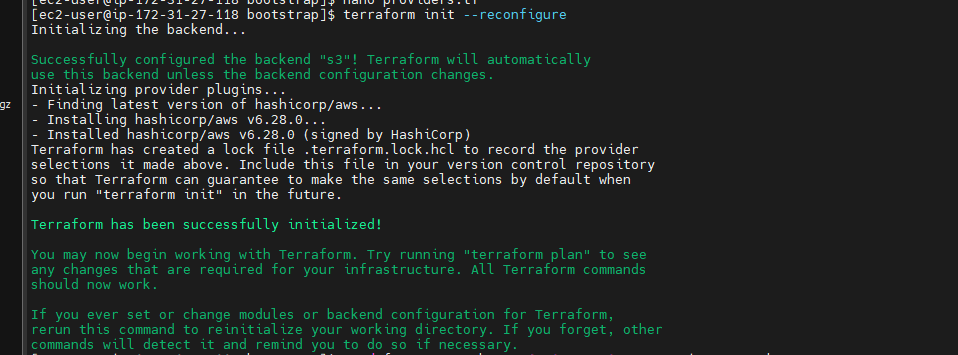
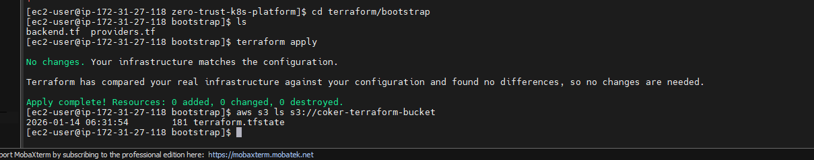
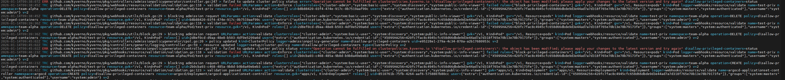
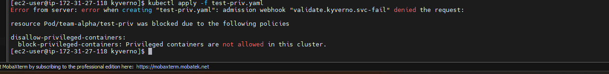
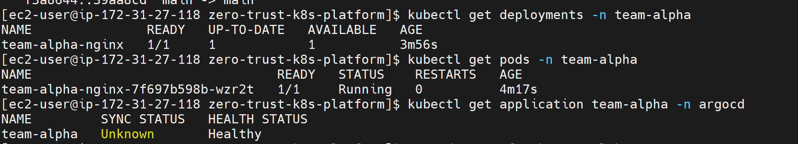
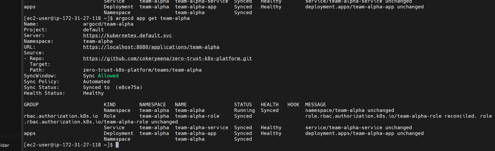

# Zero-Trust Kubernetes Platform

This repository showcases a zero-trust, multi-team Kubernetes platform that emphasizes security, policy enforcement, auditability, and GitOps-driven delivery.The platform integrates:

- Argo CD for GitOps-based application deployments

- Namespace isolation for team environments (team-alpha, team-beta)

-Secure access control for multi-cloud workloads

- Automated sync and reconciliation pipelines

- The platform demonstrates how modern DevOps practices and security-first architecture can be applied to real-life enterprise scenarios.

## Overview
- **Architecture**: Design and flow diagrams.
- **Terraform**: Infrastructure as code.
- **Platform Policies**: Enforced policies for security.
- **GitOps**: CI/CD workflows with ArgoCD.
- **Teams**: Individual team configurations.
- **CI**: Quality gates using GitHub Actions.
- **Audit**: Documentation and evidence of compliance.

## Argo CD Integration

Argo CD was used for continuous deployment of applications into isolated namespaces. Applications were configured with:

Repo URL: https://github.com/cokeryeena/zero-trust-k8s-platform.git

Paths:
- teams/team-alpha contains Argo CD application manifests specific to Team Alpha

- teams/team-beta contains manifests for Team Beta

-The root repository is the single source of truth for all cluster configurations

## Problem Encountered

- During deployment, Team Alpha’s Argo CD application would not sync:

ComparisonError: Failed to load target state: failed to generate manifest for source 1 of 1: rpc error: code = Unknown desc = gitops/applications/team-alpha: app path does not exist

## Root Cause

-The path in Argo CD was originally set to:
gitops/applications/team-alpha

-The actual repository structure was:
zero-trust-k8s-platform/teams/team-alpha

## Solution

-Verify the correct path locally
- Update the Argo CD application path
- Sync the application
- If the sync fails due to cached paths or invalid manifests, delete the application and recreate it with the correct path

## Screenshots
- Terraform Infrastructure Provisioning

Terraform Plan
Shows the planned Kubernetes and cloud resources before apply.

Terraform Apply
Confirms successful infrastructure provisioning.

- Namespace & RBAC Isolation

Namespace RBAC Isolation
Verifies that each team namespace is isolated using RBAC policies.

- Kyverno Policy Enforcement (Audit Mode)

Kyverno Audit Proof
Demonstrates Kyverno detecting policy violations without blocking resources (audit mode).

Policy Rejection Message
Shows the exact rejection/audit message generated by Kyverno.

- Argo CD GitOps Sync

Before Sync (Broken State)

Argo CD Sync

## Key Lessons

-Argo CD spec.source.path must be relative to the repository root, not the local filesystem or nested project directory.

In this project, the repository was cloned into a subdirectory (zero-trust-k8s-platform/), but Argo CD still expected paths relative to the GitHub repo root, which caused persistent sync failures until corrected.

- Argo CD caches old manifests — clearing or recreating the application may be necessary.

- Automated GitOps workflows can fail silently if paths or revisions are misconfigured.

- Keeping a screenshot log of errors helps debug issues faster and documents your troubleshooting process.

## Why This Project Matters

This project demonstrates:

- Real-world GitOps troubleshooting

- Secure multi-tenant Kubernetes design

- Policy-driven governance

- Production-style debugging and documentation
